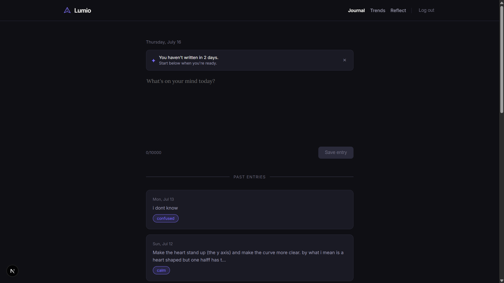
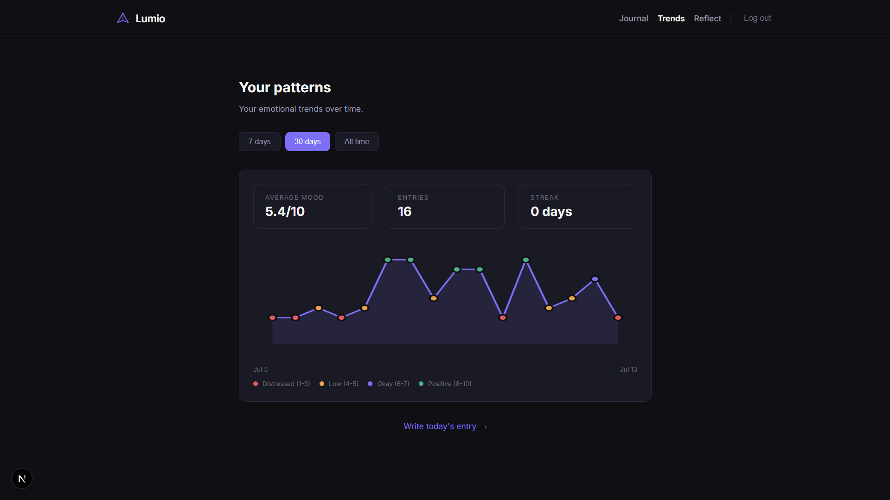
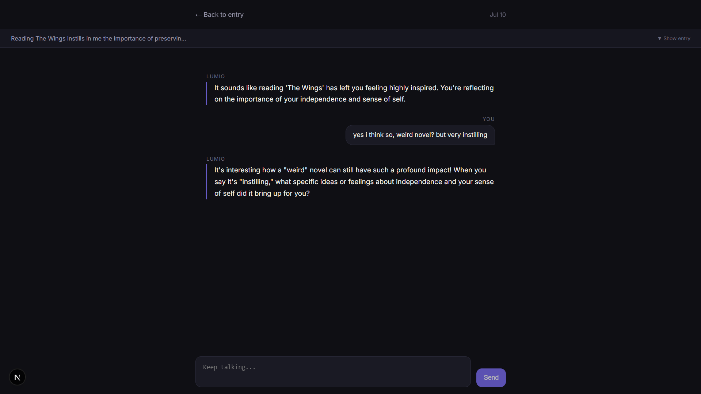
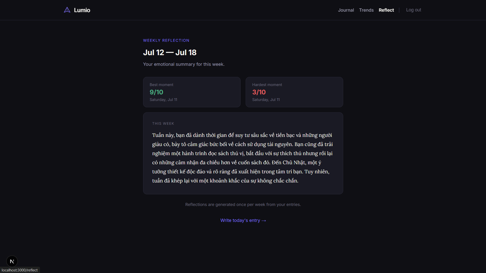
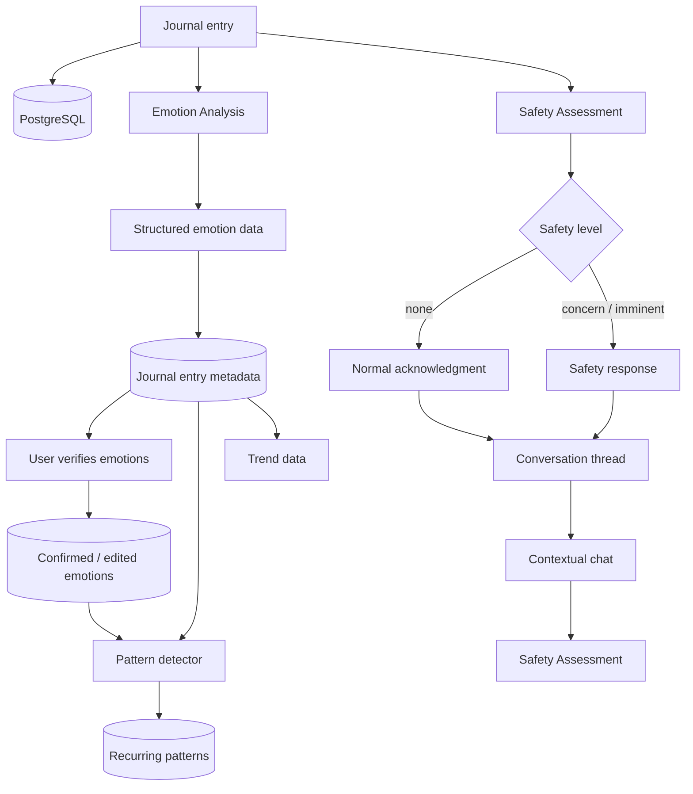

# Lumio

> A journal that helps you notice what keeps coming back.

**Live app:** https://lumio-beta-five.vercel.app  
**Built by:** Nguyen Trong Tin



---

## What is Lumio?

Most journaling apps help you write something down.

Lumio is built around a different question:

**What if your journal could help you notice patterns across what you have already written?**

A journal entry in Lumio does not disappear into an archive after it is saved. It becomes part of a longer emotional timeline.

Lumio can:

- identify emotions expressed in an entry
- let the writer confirm or correct those emotions
- remember the context of an entry during a follow-up conversation
- visualize mood changes over time
- surface recurring relationship or situational patterns
- generate a weekly reflection from recent entries

The goal is not to tell someone what their feelings mean.

Lumio surfaces observations and leaves the interpretation to the writer.

---

## Screenshots

| Journal                                  | Trends                                 |
| ---------------------------------------- | -------------------------------------- |
|  |  |

| Chat                               | Weekly Reflection                        |
| ---------------------------------- | ---------------------------------------- |
|  |  |

---

# Core experience

## 1. Write a journal entry

The entry is stored immediately before any AI processing begins.

Lumio then analyzes the entry for:

- overall mood score
- primary emotion
- up to two secondary emotions
- emotional intensity
- supporting textual evidence
- relationship context
- academic or career stressors

Emotion classification uses a fixed 28-label vocabulary:

`admiration`, `amusement`, `anger`, `annoyance`, `approval`, `caring`, `confusion`, `curiosity`, `desire`, `disappointment`, `disapproval`, `disgust`, `embarrassment`, `excitement`, `fear`, `gratitude`, `grief`, `joy`, `love`, `nervousness`, `optimism`, `pride`, `realization`, `relief`, `remorse`, `sadness`, `surprise`, and `neutral`.

The model is instructed to return an emotion only when there is evidence for it in the text rather than inferring how the writer _should_ feel.

---

## 2. Verify what Lumio noticed

AI emotion labels are not treated as ground truth.

After analysis, Lumio shows the detected emotions and asks:

> **Does this feel right?**

The writer can either:

- **confirm** the detected emotions, or
- **edit** them and choose up to three emotions themselves.

Both the original AI prediction and the writer's feedback are preserved.

When later features need an emotion label, Lumio prefers the writer's verified emotions when they are available.

---

## 3. Keep talking about an entry

Every processed journal entry gets its own conversation thread.

The initial acknowledgment becomes the first assistant message in that thread. From there, the writer can continue reflecting on the original entry.

Chat uses real multi-turn conversation history:

```text
journal entry as background context

assistant
user
assistant
user
assistant
...
```

The journal itself is passed as context rather than mixed into the trusted system instructions.

The newest message appears exactly once in the model input, and prior user/assistant roles are preserved.

Lumio's chat is designed to:

- respond in a short, conversational way
- match English or Vietnamese input
- ask at most one useful follow-up question
- avoid diagnoses and confident assumptions
- avoid unsolicited advice
- remember the original journal entry and conversation so far

---

## 4. See trends over time

The Trends page turns processed journal entries into a mood timeline.

It includes:

- mood score history
- entry excerpts
- date ranges
- average mood
- entry count
- writing streak
- recurring patterns

Individual entries can be inspected directly from the chart.

---

## 5. Surface recurring patterns

Lumio does not ask an LLM to freely invent patterns.

Instead, recurring patterns are detected deterministically from structured journal data.

Currently, Lumio looks for two kinds of recurrence:

### Relationship patterns

Examples:

```text
family
partner
friends
roommate
```

### Situational patterns

Currently:

```text
academic
career
```

A category must occur in **at least three processed entries** before Lumio considers it a pattern.

Pattern detection refreshes after every fifth processed journal entry.

A surfaced pattern might look like:

> Across 4 entries involving family, sadness appeared most often.

rather than:

> Your family causes your sadness.

That distinction is intentional. Lumio reports recurrence without claiming causation.

If a writer has verified or corrected their emotions, pattern detection prefers those emotions over the original AI prediction.

---

## 6. Weekly reflection

Once enough entries exist for the current week, Lumio can generate a short weekly reflection.

The reflection summarizes the week's emotional movement without diagnosing the writer or prescribing what they should do.

Generated reflections are stored after creation instead of being regenerated every time the page loads.

---

# Safety design

Lumio separates **emotional analysis** from **safety assessment**.

They are different tasks and use different prompts.

For every new journal entry:

```text
                 ┌── emotion analysis
journal entry ───┤
                 └── safety assessment
```

The two tasks run in parallel so adding safety does not require waiting for one full model call before starting the other.

The safety layer returns one of:

```text
none
concern
imminent
```

It is specifically instructed to distinguish between:

- ordinary negative emotions and self-harm risk
- current statements and historical discussion
- the writer and another person
- genuine intent and explicit negation
- general concern and near-term danger

If safety is classified as `concern` or `imminent`, the normal AI acknowledgment is replaced with a deterministic safety response.

The same safety assessment also runs on every new **chat message**, since risk may appear later in a conversation even if the original journal entry was not concerning.

Crisis-resource text is controlled by application code rather than allowing the language model to invent phone numbers or services.

Verified international resources are directed through:

https://findahelpline.com

---

# AI architecture

Lumio uses Google Gemini behind a provider abstraction.

All model interaction is centralized in:

```text
lib/ai/provider.js
```

The rest of the application does not directly depend on the Gemini SDK.

Current model configuration:

```text
Primary  → Gemini 3.5 Flash
Fallback → Gemini 2.5 Flash
```

The exact models can be changed through environment variables without changing the frontend or database.

---

## Structured output

Emotion analysis and safety classification use schema-constrained JSON responses.

Instead of asking the model for loosely formatted text, Lumio defines the expected object structure in code.

For example:

```json
{
  "mood_score": 4,
  "primary_emotion": "disappointment",
  "secondary_emotions": ["sadness"],
  "mood_intensity": "moderate",
  "evidence": [
    {
      "emotion": "disappointment",
      "text": "..."
    }
  ],
  "relationship_source": "family",
  "stressor_type": "none",
  "acknowledgment": "..."
}
```

The provider also includes:

- retry handling for temporary API failures
- primary-model to fallback-model switching
- low-temperature structured generation
- recovery when a model wraps otherwise valid JSON in extra text
- separate generation methods for text, structured output, and multi-turn chat

This keeps provider-specific behavior out of the rest of the application.

---

# System architecture



---

# Pattern-detection pipeline

Patterns are intentionally based on structured observations rather than unconstrained generation.

```text
processed journal entries
        ↓
relationship_source / stressor_type
        ↓
group by recurring category
        ↓
require ≥ 3 supporting entries
        ↓
prefer user-verified emotions
        ↓
calculate dominant emotion
        ↓
calculate average mood
        ↓
store supporting entry IDs + date range
        ↓
surface strongest patterns
```

This makes a surfaced pattern traceable back to the entries that support it.

---

# Tech stack

| Layer             | Technology                |
| ----------------- | ------------------------- |
| Framework         | Next.js 16 App Router     |
| UI                | React 19                  |
| Language          | JavaScript                |
| Backend           | Next.js Route Handlers    |
| Database          | PostgreSQL                |
| Database hosting  | Neon                      |
| AI SDK            | `@google/genai`           |
| Primary AI model  | Gemini 3.5 Flash          |
| Fallback AI model | Gemini 2.5 Flash          |
| Authentication    | JWT + `jose` + `bcryptjs` |
| Deployment        | Vercel                    |

---

# Database model

The main application tables are:

```text
users
journal_entries
threads
messages
patterns
weekly_reflections
```

### `journal_entries`

Alongside the original journal text, entries can store:

```text
mood_score
mood_label
secondary_emotions
emotion_evidence
mood_intensity

relationship_source
stressor_type

user_emotions
emotion_feedback
emotion_feedback_at

safety_level

ai_acknowledgment
ai_processed_at
thread_id
```

This lets Lumio preserve three different layers separately:

```text
what the writer wrote
what the AI inferred
what the writer confirmed
```

---

# API overview

The application exposes versioned routes under:

```text
/api/v1
```

Main areas include:

```text
/api/v1/auth
/api/v1/entries
/api/v1/entries/:id
/api/v1/entries/:id/thread
/api/v1/entries/:id/thread/messages
/api/v1/trends
/api/v1/trends/patterns
/api/v1/reflections
/api/v1/users/me
/api/v1/health
```

Examples:

### Create a journal entry

```http
POST /api/v1/entries
```

```json
{
  "content": "..."
}
```

### Confirm or correct emotions

```http
PATCH /api/v1/entries/:id
```

```json
{
  "emotions": ["sadness", "disappointment"],
  "feedback": "edited"
}
```

### Continue a conversation

```http
POST /api/v1/entries/:id/thread/messages
```

```json
{
  "content": "I think what bothered me was being ignored."
}
```

### Read recurring patterns

```http
GET /api/v1/trends/patterns
```

---

# Project structure

```text
lumio/
│
├── app/
│   ├── api/
│   │   └── v1/
│   │       ├── auth/
│   │       ├── entries/
│   │       ├── health/
│   │       ├── reflections/
│   │       ├── trends/
│   │       └── users/
│   │
│   ├── about/
│   ├── chat/
│   ├── journal/
│   ├── login/
│   ├── onboarding/
│   ├── reflect/
│   ├── signup/
│   ├── trends/
│   └── page.js
│
├── components/
│   └── Navbar.js
│
├── lib/
│   ├── ai/
│   │   ├── provider.js
│   │   ├── aiService.js
│   │   └── prompts/
│   │       ├── analyzeMood.js
│   │       ├── assessSafety.js
│   │       └── generateReflection.js
│   │
│   ├── db/
│   │   ├── index.js
│   │   ├── migrations/
│   │   └── queries/
│   │
│   ├── middleware/
│   │   └── auth.js
│   │
│   └── patterns/
│       └── patternService.js
│
├── docs/
│   ├── product-spec.md
│   ├── user-flow.md
│   ├── wireframes.md
│   ├── data-model.md
│   ├── api-spec.md
│   ├── ai-architecture.md
│   └── roadmap.md
│
├── public/
├── package.json
└── README.md
```

---

# Running Lumio locally

## 1. Clone the repository

```bash
git clone https://github.com/speechless29/lumio.git
cd lumio
```

## 2. Install dependencies

```bash
npm install
```

## 3. Create `.env.local`

```env
DATABASE_URL=postgresql://...

JWT_SECRET=your_secret

GEMINI_API_KEY=your_google_ai_api_key

GEMINI_MODEL=gemini-3.5-flash
GEMINI_FALLBACK_MODEL=gemini-2.5-flash
```

Do not commit `.env.local` or API keys.

## 4. Set up PostgreSQL

Run the SQL migrations in:

```text
lib/db/migrations/
```

in numerical order:

```text
001_initial_schema.sql
002_emotion_details.sql
003_emotion_feedback.sql
004_safety.sql
```

## 5. Start development

```bash
npm run dev
```

Then open:

```text
http://localhost:3000
```

## 6. Production build

```bash
npm run build
npm start
```

---

# Design principles

## The user gets the final say

AI-generated emotion labels are suggestions.

Users can confirm or correct them, and Lumio preserves both.

## Evidence before inference

The emotion model is instructed to support returned emotions with text from the journal entry and avoid inventing emotional nuance that is not expressed.

## Observations, not causes

Lumio can say:

> Across four entries involving family, sadness appeared most often.

It should not say:

> Your family is making you depressed.

## Safety is a separate task

Emotional negativity alone should not automatically become a crisis classification.

Safety assessment is handled independently from ordinary emotion analysis.

## Journal text is untrusted input

Journal entries are treated as data.

Prompts explicitly tell the model not to follow instructions that appear inside an entry.

## AI failure should not erase writing

The journal entry is stored before AI analysis begins.

If model processing fails, the original writing remains in the database.

---

# Documentation

Lumio was planned with separate product and technical documents before implementation.

The `/docs` directory includes:

| Document             | Purpose                                                |
| -------------------- | ------------------------------------------------------ |
| `product-spec.md`    | Product vision, target experience, scope and decisions |
| `user-flow.md`       | Main user journeys and navigation                      |
| `wireframes.md`      | Screen-level interface planning                        |
| `data-model.md`      | Original database design                               |
| `api-spec.md`        | REST API planning                                      |
| `ai-architecture.md` | Original AI architecture and behavior rules            |
| `roadmap.md`         | Development plan and implementation sequence           |

Some implementation details have evolved beyond the original planning documents as the application was tested and refined. The current source code is the authoritative representation of the implemented system.

---

# Current status

Core product loop:

- [x] Account creation and login
- [x] Journal creation and history
- [x] Structured 28-label emotion analysis
- [x] Primary + secondary emotions
- [x] Evidence-backed emotion output
- [x] User emotion confirmation and correction
- [x] Mood timeline
- [x] Recurring relationship and situational patterns
- [x] Entry-linked multi-turn AI chat
- [x] Safety assessment for journal entries
- [x] Safety assessment during chat
- [x] English/Vietnamese AI responses
- [x] Weekly reflections
- [x] Gemini retry and fallback handling
- [x] AI transparency page

---

# Limitations

Lumio is an experimental personal software project, not a clinical system.

Current limitations include:

- mood scores are AI estimates rather than clinical measurements
- emotion classification can still be wrong
- recurring patterns depend on the structured categories extracted from entries
- pattern detection currently focuses on relationship, academic, and career context rather than arbitrary semantic themes
- AI services can experience latency, quota limits, or temporary failures
- generated reflections and chat responses should not be interpreted as professional mental-health advice

---

# Why I built it

Lumio started from a simple frustration with the way many journaling and AI experiences are isolated.

Writing something once can be useful, but the more interesting questions often appear later:

- Has this situation come up before?
- Do I describe it differently now?
- Which emotions keep appearing around the same parts of my life?
- Was this one bad day, or something recurring?

Building Lumio became an exercise in both software engineering and uncertainty.

The difficult part was not simply connecting an AI API. It was deciding when the model should infer something, when it should stay uncertain, what evidence it should provide, when the user should be able to correct it, and when a completely separate safety system should take control.

The result is a journal designed around **reflection, continuity, and user verification** rather than treating every model prediction as an answer.

---

## Disclaimer

Lumio is not therapy, a medical device, or a substitute for professional mental-health care.

If you or someone else may be in immediate danger, contact local emergency services or an appropriate crisis-support service.

International support resources can be found at:

https://findahelpline.com
